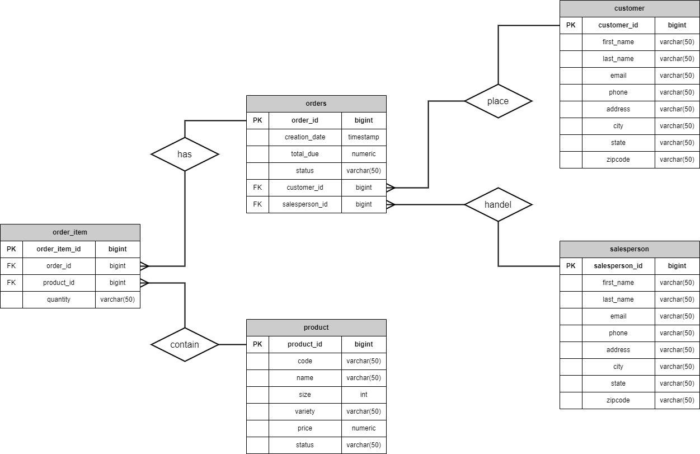

# Introduction
- What does this project do?
This project is designed to connect to a PostgreSQL database, "hplussport", and implement various operations on the customer and order tables using JDBC. The project includes two main classes: CustomerDao and OrderDao. These Data Access Objects are for interaction with the database.
In addition, multiple Persistence Objects and Data Transfer Objects are implemented for storing data in the database and passing values between layers.
Junit Tests are used to test all features
- Technologies 
    - Java 8
    - Maven
    - Java Database Connectivity (JDBC)
    - PostgreSQL
    - Docker
    - SQL scripts

# Quick Start
**Nessesary packages:**
1. Java 8
2. Maven
3. Docker
4. PostgreSQL

**Make sure that your PSQL Docker is up and running.**
1. Pull the repository onto your machine.
2. Use Maven to build the project.
3. Use Commands and SQL scripts in `~/jdbc/sql` to create the database and insert testing data.
4. Run the main function in `~/jdbc/src/main/java/ca/jrvs/apps/jdbc/JDBCExecutor.java` to interact with DAOs(Data Access Objects).

# Implementaiton
## ER Diagram

## Design Patterns

This Project is using the DAO Pattern (Data Access Object Design Pattern) since it only involves the basic CRUD operations on a database. On the other hand, Repository Pattern provides functions that are more complex and closer to the business logic needed to manipulate databases.

- Data Access Object Design Pattern
The DAO Pattern is focused on providing a simple and consistent interface for accessing data in a particular data store, such as a database. It typically defines a set of methods that perform common CRUD operations on the data store, and allows the application to interact with the data store using a high-level API that abstracts away the details of the underlying data store.

- Repository Design Pattern
The Repository Pattern, on the other hand, is focused on providing a higher-level abstraction for accessing and managing data. It typically defines a set of methods that map more closely to the business logic of the application than to the low-level details of the data store. For example, instead of providing a simple CRUD interface, a repository might provide methods for retrieving all orders for a particular customer, or for computing the average order value across all orders.

# Test
I used JUnit tests to test all features because I wanted to test the program in a more systematic and repeatable way to ensure that all functions would work as expected. The JUnit file is under the directory `~/jdbc/src/test/java`.
To test the result, I create an object with the expected data in it. Then I used `assertEquals()` to compare the actual values retrieved from the database with the expected values. Since I didn't implement the `equals()` method in my classes. I compare their values using the results from the `toString()` method.
