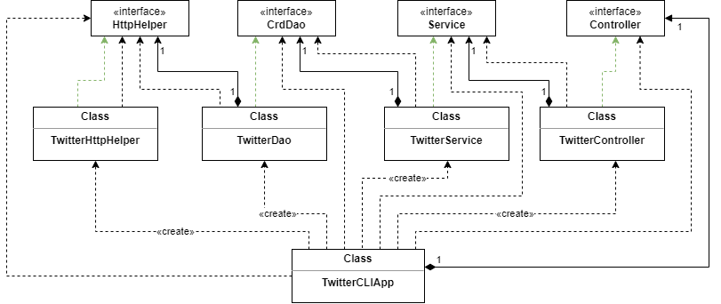

# Introduction
- What does this project do?
  This project is a Twitter application using Java 8. I managed my project dependencies using Maven, and dependencies within the project using the Spring framework. The app interacts with Twitter using the Twitter REST API V2. It allows users to post, delete, and lookup tweets by ID using Linux command lines. Sadly, the lookup feature is a paid feature in the Twitter API v2. So only users with API keys in the paid tier can use the lookup feature. The project is packaged as a Docker image for easier distribution.
- Techonologies:
    - Java
    - Spring Boot
    - HTTP Client
    - Twitter API v2
    - Docker
    - Maven

# Quick Start
Nessesary Packages:
1. Java 8
2. Maven
3. Docker

- Approach 1. Clone the source code and package the App using Maven.
    ```Bash
    # Open the terminal in the project directory "~/twitter"
    #Clean any artifacts created by previous builds and package the project
    mvn clean package
    
    # Set up your Environtment variables
    export API_KEY=<your_consumer_key>
    export API_SECRET=<your_consumer_secret>
    export ACCESS_TOKEN=<your_access_token>
    export ACCESS_TOKEN_SECRET=<your_access_token_secret>
    
    # Run the jar file in the "/target" file
    Java -jar target/twitter-1.0-SNAPSHOT.jar <Arguments>
    
    #Arguments syntax:
    # post "content"
    #delete [tweet_id_1,tweet_id_2,...]
    #show <tweet_id> [field_1,field_2,...]    (Paid feature)
    ```
- Approach 2. Run the app using docker.
    ```bash
    # Pull the docker image form the Docker Hub
    docker pull seanchen1999/twitter_app
    
    # Set up the Environment variables of docker container and run the app with arguments in the syntax above
    # An example would be
    docker run --rm \
    -E API_KEY=<your_consumer_key> \
    -E API_SECRET=<your_consumer_secret> \
    -E ACCESS_TOKEN=<your_access_token> \
    -E ACCESS_TOKEN_SECRET=<your_access_token_secret> \
    seanchen1999/twitter_app post "Hello World!"
    ```

# Design
## UML diagram

## Components
- **App/main (`TwitterCLIApp.java`):**
  The main function identifies the input arguments and calls the corresponding method in the controller. In this stage, the main function only checks the number of arguments. It throws an IllegalArgumentException if the number of arguments is not valid.
- **spring:**
  This directory contains the Spring Boot configuration and the Spring App Class. The Spring Framework manages dependencies between classes. So I can use the Autowire feature to inject the dependencies for the controller without having to create one myself using all of its dependencies.
- **controller:**
  This directory contains the `controller` interface and its implementation, the `TwitterController` class. This layer validates users input and calls the coresponding service layer function. It will throw an IllegalArgumentException if there is an invalid input.
- **service:**
  This directory contains the `service` interface and its implementation, the `TwitterService` class. This layer handles the business logic where it interacts with the DAO (data access objects) and modifies the return value into a desired format.
- **dao:**
  This directory contains the `CrdDao` interface (Create, Read, Delete DAO) and its implementation, the TwitterDao` class. It also contains a helper class that helps to send the HTTP request and return the HTTP response. This layer does not validate input; it only processes the input and returns a response.

## Models
A retrieved tweet model by this App would contain following properties:
```JSON
{
  "data" : {
    "id" : null,
    "text" : null,
    "entities" : {
      "mentions" : [ {
        "start" : null,
        "end" : null,
        "tag" : null
      } ],
      "hashtags" : [ {
        "start" : null,
        "end" : null,
        "tag" : null
      } ]
    },
    "deleted" : false,
    "created_at" : null,
    "public_metrics" : {
      "retweet_count" : null,
      "reply_count" : null,
      "like_count" : null,
      "quote_count" : null
    }
  },
  "includes" : {
    "places" : [ {
      "geo" : {
        "type" : null,
        "bbox" : null
      },
      "name" : null,
      "country" : null,
      "full_name" : null
    } ]
  }
}
```
## Spring
Spring Boot was used in the application to manage all dependencies between classes. Instead of creating an object in each class using all its dependencies in each class. I used Spring Autowire feature to inject the dependencies into a class.

In order to make the dependency injection work, all dependencies were marked using corresponding Component annotation(Controller annotation, Service annotation etc.). Then the ComponentScan is used to auto scan all Beans.

# Test
Both Unit Test and Integrated Test were applied on each layer using Junit Test.
- For the Unit Test, Mockito Framework was used to mock the behaviour of other layers. This way, only codes for one single layer were run and tested at a time.

- For the Integrated Test, all dependencies are injected into the tested class. This way, the behaviour of the tested class and its dependencies will be tested at the same time.

## Deployment
This app is deployed on Docker Hub for easier distribution. Any computer that has Docker installed is able to run this app. Here is how to deploy your own App on Docker Hub:
```bash
#navigate to the root direcotry of your project
cd <your_project_dir>

# log in with your Docker Hub account
docker login -u <docker_username>

# Use maven to pack your Java App
mvn clean package

# Before you build the image, modify the ENV values in the dockerfile so you don't have to enter environment variables every time you run the docker container.
# build a new docker image locally
docker build -t <docker_username>/<your_image_name>

# verify your image
docker image ls | grep "<your_image_name>"
#run docker container
docker run --rm  <docker_username>/<your_image_name> post "Hello World!"

# push your image to Docker Hub
docker push <docker_username>/<your_image_name>
```
# Improvements
- More attachments can be added when posting a tweet. For example, a geographic location or a poll can be added to a tweet. Features like starting a poll and receiving poll results after the poll ends could be added to enhance the user experience.
- More specific log messages could be added to inform the user what has happened. For example, output a message like "Permission denied" in the terminal when a user tries to delete a tweet that is not under that user's account. For now, the app just throws an exception when the unexpected HTTP code was returned.
- Existing Twitter API libraries, such as Twitter4J, can be used. These libraries provide a higher-level interface to the Java API and they also provides vairous features. Using libraries can simplify the development process and code.