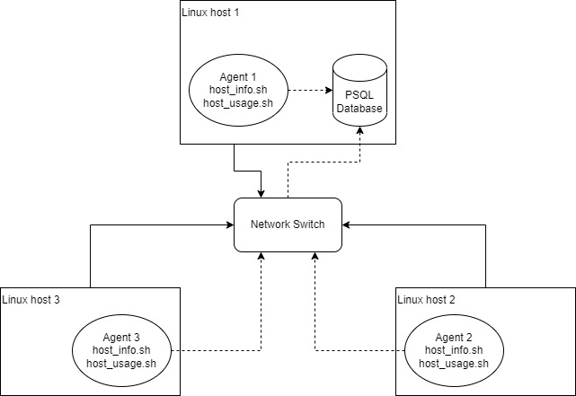

# Linux Monitoring Agent
## Introduction
### What does this project do?
This project contains multiple shell scripts to monitor and store the hardware usage of the server every minute. The collected data will be stored in a PostgreSQL database for future use.

### Technologies used:
- **Google Cloud Platform (GCP)**: For building the cloud VM (remote desktop) running CentOS 7.
- **Docker**: Provision the PostgreSQL instance.
- **PostgreSQL**: Store the gathered data.
- **Linux Command & Bash Script**: Implement features of the project.
- **Git & GitHub**: Store and manage code versions.

## Quick Start
#### Packages needed

 1. Docker
 2. PostgreSQL 10

 **Use the "./scripts/psql_docker.sh" file to create, start, or stop the PSQL instance.**
 Recommended db_username: postgres

    #script usage
    ./scripts/psql_docker.sh start|stop|create <db_username> <db_password>
    
    #if first time, use create to create a psql docker container
    ./scripts/psql_docker.sh create <db_username> <db_password>
    
    #to start the psql docker container
    ./scripts/psql_docker start
    
    #to stop the psql docker container
    ./scripts/psql_docker stop
    
**Use the following command to connect to the PSQL instance and set up the database:**

    # connect to psql instance
    psql -h localhost -U postgres -d postgres -W
    
    -- create a database called host_agent
    postgres=# CREATE DATABASE host_agent;
    
    -- list all database
    postgres=# \l

If everything went well. You can type `\q` to exit the psql instance and use "./sql/ddl.sql" to create two tables: "host_info" and "host_usage" if they do not already exist.

    # Execute ddl.sql script on the host_agent database to create host_info and host_usage
    psql -h localhost -U postgres -d host_agent -f sql/ddl.sql

**Execute “./scripts/host_info.sh” to get hardware specifications and store them into the host_info table.**

    # script usage
    ./scripts/host_info.sh <psql_host> <psql_port> <db_name> <psql_user> <psql_password>
    
    # script example (recommended usage)
    ./scripts/host_info.sh localhost 5432 host_agent postgres <your_password>

**Execute “./scripts/host_usage.sh” to get real-time usage information and store it into the host_usage table.**

    # script usage
    ./scripts/host_usage.sh <psql_host> <psql_port> <db_name> <psql_user> <psql_password>
    
    # script example (recommended usage)
    bash scripts/host_usage.sh localhost 5432 host_agent postgres <your_password>

**Connect to the PSQL instance to check if both scripts insert data correctly.**

    # connect to host_agent database
    psql -h localhost -U postgres -d host_agent -W
    
    -- Print all data in host_info table
    host_agent=# SELECT * FROM host_info;
    
    -- Print all data in host_usage table
    host_agent=# SELECT * FROM host_usage;

**If everything goes well, we can now automate this process using Crontab.**

    # Edit crontab file
    corntab -e
    
    # add this command to your crontab file to execute host_usage.sh every minute
    # and record the exit code to a log file (optional)
    * * * * * <absolute path of host_usage.sh> <psql_host> <psql_port> <db_name> <psql_user> <psql_password> > [log directory]
    
    # example
    * * * * * bash /home/centos/dev/jarvis_data_eng_xuanfu/linux_sql/scripts/host_usage.sh localhost 5432 host_agent postgres password > /tmp/host_usage.log

## Implemenation

1. Created and configured a Linux server running with CentOS 7 on Google Cloud Platform  
2. Installed Docker and created a PostgreSQL Docker container using the PostgreSQL:10 image from the Docker Hub.  
3. Installed the PSQL client and setup the PSQL database.  
	- Created the "host_agent" database to store data for the project.  
	- Created the "host_info" table to store the hardware specification  
	- Created the "host_usage" table to store real-time server usage for each host.  
4. Created scripts for collecting corresponding data and added it to the database.  
5. Used Crontab to automate the "host_usage" script to update the "host_usage" table every minute.

### Architecture


### Scripts
Description and usage of Shell scripts
 1. **psql_docker.sh**
This script can start, stop, or create the PostgreSQL Docker container depending on the parameters. 
When creating the Docker container, the name of the container would always be jrvs-psql. The username and password of the database would depend on the input parameters.
      ```
      #script usage
      ./scripts/psql_docker.sh start|stop|create <db_username> <db_password>
      ```
 2. **host_info.sh**
This script can get hardware specifications from the output of the `lscpu` command and insert those data into the host_info table in the database.  
Hardware specification includes host name, number of CPU(s), CPU architecture, CPU model, CPU frequency, L2 cache size, timestamp, and total memory.
      ```
      #script usage
      ./scripts/host_info.sh <psql_host> <psql_port> <db_name> <psql_user> <psql_password>
      ```      
 3. **host_usage.sh**
This script can gather real-time server resource usage from the output of the `vmstat` command and insert it into the host_usage table.  
Resource usage information includes: timestamp, host ID, free memory, CPU idle percentage, CPU kernel, disk IO, and available disk space. In addition, the corresponding host ID is found by using the host name in a sub-query.
      ```
      #script usage
      ./scripts/host_usage.sh <psql_host> <psql_port> <db_name> <psql_user> <psql_password>
      ```
 4. **Crontab**
Corntab is used to automate the execution of "host_usage.sh". By adding the following line to the Crontab file, the "host_usage.sh" script will be executed every minute, that is, updating server resource usage information to the database on a minute-by-minute basis.
      ```
      # add this command to your crontab file to execute host_usage.sh every minute
      # and record the exit code to a log file (optional)
      * * * * * <absolute path of host_usage.sh> <psql_host> <psql_port> <db_name> <psql_user> <psql_password> > [log directory] 
      ```

### Database Modeling
The schema of each table
- `host_info`

  | Column Name  | Data Type  | Constraint  |
  | -- | -- | -- |
  | id  | SERIAL  | NOT NULL, PRIMARY KEY  |
  | hostname  | VARCHAR  | NOT NULL, UNIQUE  |
  | cpu_number  | INT2  | NOT NULL  |
  | cpu_architecture   | VARCHAR  | NOT NULL  |
  | cpu_model  | VARCHAR  | NOT NULL  |
  | cpu_mhz  | FLOAT8  | NOT NULL  |
  | l2_cache  | INT4  | NOT NULL  |
  | "timestamp"  | TIMESTAMP  | |
  | total_mem  | INT  | |

- `host_usage`

  | Column Name  | Data Type  | Constraint  |
  | -- | -- | -- |
  | "timestamp"  | TIMESTAMP  | NOT NULL  |
  | host_id  | SERIAL  | NOT NULL, FOREIGN KEY REFERENCE host_info(id) |
  | memory_free  | INT4  | NOT NULL  |
  | cpu_idel   | INT2  | NOT NULL  |
  | cpu_kernel  | INT2  | NOT NULL  |
  | disk_io  | INT4  | NOT NULL  |
  | disk_available  | INT4  | NOT NULL  |


## Test
As there were not many repetitive tasks in the testing process, I manually tested all the scripts.

- Testing psql_docker.sh.
	- Test create feature

	      # create the 'jrvs-psql' psql container with database username "postgres" and password
	      ./scripts/psql_docker.sh create postgres <password>

	      # check if there is a container named 'jrvs-psql' running
	      docker container ls -a -f name=jrvs-psql
	     As a result, you should see a table like the one below:

      | CONTAINER ID | IMAGE | COMMAND  | CREATED  | STATUS  | PORTS  | NAMES  |
      |--|--|--|--|--|--|--|
      | 92889edc9104 | postgres:10 |  "docker-entrypoint.s.." |  44 hours ago | Up 23 hours | 0.0.0.0:5432->5432/tcp, :::5432->5432/tcp | jrvs-psql |

- - Testing stop feature. 

	      # create the 'jrvs-psql' psql container with database username "postgres" and password
	      ./scripts/psql_docker.sh create postgres <password>

	      # check if there is a container named 'jrvs-psql' running
	      docker container ls -a -f name=jrvs-psql
	     As result, you should see a table like below.

	As a result, you shouldn't see any thing in the table anymore.

- - Testing start feature.

	      # stop the 'jrvs-psql' container
	      ./scripts/psql_docker.sh start
		
	      # check if there is a container named 'jrvs-psql' running
	      docker container ls -a -f name=jrvs-psql
	As a result, you shouldn't see the 'jrvs-psql' container's information in the table again.
	

- Testing host_info.sh.

	    # run the host_info.sh
	    ./scripts/host_info.sh localhost 5432 host_agent postgres <your_password>
	    
	    # connect to psql instance
	    psql -h localhost -U postgres -d host_agent -W
	    
	    -- check all data in host_info table
	    host_agent=# SELECT * FROM host_info;
	As a result, you should be able to see the information about your host machine in the table, like the one below: 

  | id | hostname | cpu_number | cpu_architecture | cpu_model | cpu_mhz | l2_cache | timestamp | total_mem |
  |--|--|--|--|--|--|--|--|--|
  | 1 | jrvs-remote-desktop-centos7.us-east1-c.c.striking-lane-379122.internal | 2 | x86_64 | Intel(R) Xeon(R) CPU @ 2.20GHz | 2200.214 | 256 | 2023-03-08 20:19:32 | 4053556 |

- Testing host_usage.sh.

	    # run the host_usage.sh
	    ./scripts/host_usage.sh localhost 5432 host_agent postgres <your_password>
	    
	    # connect to psql instance
	    psql -h localhost -U postgres -d host_agent -W
	    
	    -- print one record in host_usage table 
	    -- just in case your automation was already running for a while and there were tons of records in the table
	    host_agent=# SELECT * FROM host_usage LIMIT 1;
	As a result, you should be able to see the system usage of your host machine in the table, like the one below:
	
  | timestamp | host_id | memory_free | cpu_idle| cpu_kernel | disk_io | disk_available |
  |--|--|--|--|--|--|--|
  | 2023-03-08 21:43:13 | 1 | 3354 | 96 | 3 | 0 | 22604 |

- Testing if crontab is running correctly.
	```
    -- print most recent 5 record in host_usage table 
    host_agent=# SELECT * FROM host_usage ORDER BY timestamp LIMIT 5;
	```
	As a result, you should see a table with 5 records whose times should be 5 consecutive minutes.

## Deployment
The app was deployed using Crontab on a cloud machine running CentOS 7. If you want to deploy it on your own machine, please follow the [Quick Start](https://github.com/Jarvis-Consulting-Group/jarvis_data_eng-xuanfuchen/tree/develop/linux_sql#quick-start) guide above.

## Improvements

- A feature for handling hardware updates can be added. Perhaps update the hardware specification once a day.
- The robustness of the system can be improved.
- Create a GUI for easier use and a straightforward view.
